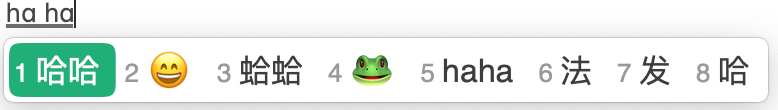

Rime是一款开源的输入法引擎，支持多种平台，包括Windows、MacOS、Linux等。Rime的特点是高度可定制，用户可以自定义输入方案，包括词库、词频、快捷键等。基于Rime引擎，在不同的平台上有不同的前端输入法，如Windows上的小狼毫、MacOS上的鼠须管、Linux上的Fcitx等。本文介绍如何在MacOS上安装鼠须管（Squirrel）输入法。使用鼠须管输入法，用户可以输入中文、英文、日文、韩文等多种语言，支持拼音、五笔、注音、仓颉等多种输入法。虽然MacOS自带了中文输入法，但经常听到有人说有bug，用久了会卡死，而鼠须管输入法没有这个问题。鼠须管的另一个优点是开源、词库离线，对于有隐私需求的用户来说是一个不错的选择。

## 下载安装鼠须管

可以去[官方网站下载](https://rime.im/download/)安装包，但是用Homebrew安装更方便。在终端输入以下命令：

```bash
brew install --cask squirrel
```

安装完成后需要重启电脑。重启后需要手动添加一下，点击menu bar上的输入法图标，选择`open keyboard settings`，然后点击左下角的`+`号，选择`Chinese (Simplified)`，然后选择`Squirrel`，点击`Add`。

## 下载安装输入方案

鼠须管输入法的输入方案是独立的，需要单独下载。输入方案的安装方法是下载方案文件，放到`~/Library/Rime`目录下。这里推荐一个方案，[雾凇拼音](https://github.com/iDvel/rime-ice)，也已经被很多人推荐了。下载并使用的步骤如下：

```bash
# 进入Library目录
cd ~/Library
# 备份原有Rime配置
mv Rime Rime.old
# 下载雾凇拼音
git clone --depth=1 https://github.com/iDvel/rime-ice.git Rime-ice
# 建立软链接
ln -s Rime-ice Rime
```

这里的`~`表示用户目录。如果我的用户名是`jjliu`，那么`~`就是`/Users/jjliu`。

然后在menu bar上的输入法图标中选择`Deploy`，部署输入方案。部署完成后就可以使用了。

雾凇拼音是持续更新的，可以定期更新。如果要更新，进入`~/Library/Rime`目录，执行以下命令：

```bash
# 进入Rime目录
cd ~/Library/Rime
# 更新
git pull
```

然后同样点击`Deploy`，就部署了更新后的输入方案。

雾凇拼音的配置已经写得很好了，一般用户只要使用就行了，如果想详细了解配置，可以参考[作者的博客](https://dvel.me/posts/rime-ice/)。

## 自定义皮肤

最近流行的微信输入法虽然我不敢用（出于隐私考虑），但是皮肤确实好看。于是有人给鼠须管设计了一个类似微信输入法的皮肤，作者lewang，地址: https://gist.github.com/lewangdev/f8ebbba24f464e915fb7d36857fcbbe5. 把这几个文件下载下来(右上角有下载zip压缩包的按钮)，解压后把这几个文件放到`~/Library/Rime`目录下。值得注意的是，`~`目录下的`Library`是隐藏目录，可以在Finder中按`Command+Shift+.`显示隐藏文件夹。但这样比较麻烦，可以在终端用命令行移动文件：

```bash
cd ~/Downloads
cd f8ebbba24f464e915fb7d36857fcbbe5 # 这个目录是解压后的目录名，根据实际情况修改
mv *.yaml ~/Library/Rime
```

移动文件后需要重新点击`Deploy`。

如果要使用别的皮肤，可以修改文件`~/Library/Rime/squirrel.custom.yaml`的style字段。

最后的效果如下图：



## 参考资料

主要参考的是lewang的推特（现X），链接: https://x.com/lewangdev/status/1643083362154995712
