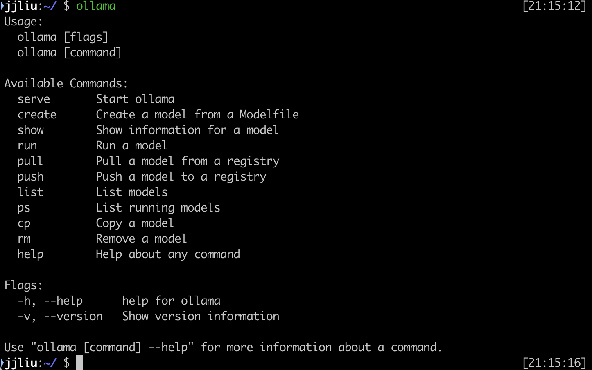

## ollama

首先下载`ollama`, 官网下载地址: https://ollama.com/

安装完成后，在终端输入`ollama`，可以看到ollama的使用说明。



下载并运行大语言模型，只需要运行`ollama run`命令即可，例如要下载Google的开源模型`Gemma2`, 则运行

```bash
ollama run gemma2:2b
```

`2b`表示模型的参数量。`gemma2`有`2b`, `9b`, `27b`三个版本。参数量越大，模型效果越好，但是运行速度也会变慢，也会消耗更多的内存。

首次运行会自动下载模型，之后再次运行时会直接加载模型，然后就可以和模型进行对话了。


退出时输入`/bye`。

`ollama`支持的模型的完整列表可以在这里查看: https://ollama.com/library

查看已经下载的模型列表可以使用命令：

```bash
ollama list
```

更多的使用方法可以查看`ollama`的Github仓库: https://github.com/ollama/ollama

## Enchanted

在命令行终端进行对话不太方便，`Enchanted`是一个基于`ollama`的图形界面工具，可以更方便的和模型进行对话，并且可以保存对话记录。

`Enchanted`可以直接在App Store中下载安装: https://apps.apple.com/us/app/enchanted-llm/id6474268307

安装完成后，打开`Enchanted`，右上角可以选择`ollama`安装的本地模型，如下图所示:


## OpenCat

另一个支持本地模型的App是`OpenCat`, 地址: https://opencat.app/

`OpenCat`不仅支持本地模型，也可以和例如OpenAI的GPT-4等云端模型进行对话（需要API Key）。
