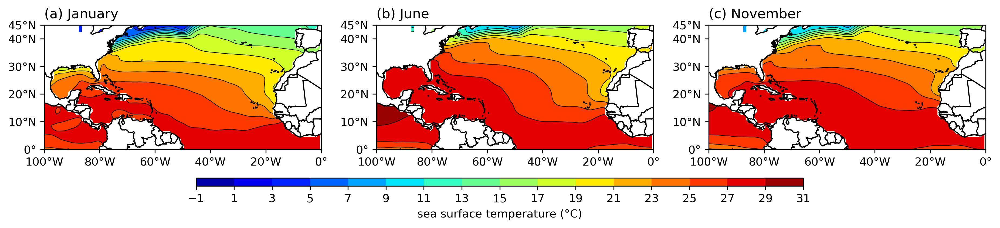

大气科学中常常需要在地图上绘制一些变量的分布，例如温度、湿度、风场等。在Python中，我们可以使用`matplotlib`和`cartopy`库来绘制这些地图。本文将介绍如何在地图上绘制多个变量的分布，并将这些地图放在一个图中。

## 代码

```python
import xarray as xr
import matplotlib.pyplot as plt
import cartopy.crs as ccrs
import cartopy.feature as cfeature
from cartopy.mpl.ticker import LongitudeFormatter, LatitudeFormatter
import cmaps

# Open the NetCDF file
file_path = "sst.mon.ltm.1991-2020.nc"
ds = xr.open_dataset(file_path)
# print lon and lat range
print(ds['lon'].values)
print(ds['lat'].values)
# Define the region limits
lon_min, lon_max = 260, 360
lat_min, lat_max = 0, 45
# Extract the variables
var_name = 'sst'
data1 = ds[var_name].isel(time=0) # January
data2 = ds[var_name].isel(time=5) # June
data3 = ds[var_name].isel(time=10) # November
# check data dimension
print(data1.shape, data2.shape, data3.shape)
# Define the projection
projection = ccrs.PlateCarree()
# Create the figure and subplots
fig, axes = plt.subplots(1, 3, subplot_kw={'projection': projection}, figsize=(15, 5))
# Define the data list and titles
data_list = [data1, data2, data3]
titles = ['(a) January', '(b) June', '(c) November']
# Find the common color limits
vmin = min(data1.min().values, data2.min().values, data3.min().values)
vmax = max(data1.max().values, data2.max().values, data3.max().values)
print("Common color limits:", vmin, vmax)
# round the limits to the nearest 1
vmin = int(vmin)
vmax = int(vmax) + 1
# define the levels
levels = range(vmin, vmax, 2)
# lon and lat ticks
lon_formatter = LongitudeFormatter(zero_direction_label=False)
lat_formatter = LatitudeFormatter()
# colormap
cmap = cmaps.MPL_jet
# Plot the data
for ax, data, title in zip(axes, data_list, titles):
    cs = ax.contourf(data['lon'], data['lat'], data, transform=projection, levels=levels, cmap=cmap)
    # add contour lines
    ax.contour(data['lon'], data['lat'], data, transform=projection, levels=levels, colors='k', linewidths=0.5)
    # Add features
    ax.coastlines()
    ax.add_feature(cfeature.BORDERS)
    ax.set_extent([lon_min, lon_max, lat_min, lat_max], crs=projection)
    # title position: left aligned
    ax.set_title(title, loc='left')
    # Set ticks
    ax.set_xticks([-100, -80, -60, -40, -20, 0], crs=projection)
    ax.set_yticks([0, 10, 20, 30, 40, 45], crs=projection)
    ax.xaxis.set_major_formatter(lon_formatter)
    ax.yaxis.set_major_formatter(lat_formatter)
# Add a single colorbar for all subplots, colorbar position is below the subplots and horizontal
axins = fig.add_axes([0.25, 0.25, 0.5, 0.02])
fig.colorbar(cs, cax=axins, orientation='horizontal', ticks=levels, label='sea surface temperature (°C)')
# save the plot
save_path = '.'
fig_name = 'sst-ltm'
plt.savefig(f'{save_path}/{fig_name}.png', dpi=300, bbox_inches='tight')
# Display the plot
plt.show()
```

## 说明

- 使用了`xarray`库来处理NetCDF文件，`matplotlib`和`cartopy`库来绘制地图。
- `cmaps`是一个自定义的colormap库，使用cmaps可以使用NCL的colormap。
- `cartopy`库提供了很多地图投影方式，这里使用了`PlateCarree`投影。
- `contourf`函数用来绘制填充等值线图，`contour`函数用来绘制等值线。
- `add_feature`函数用来添加地图特征，例如海岸线、边界等。
- `set_extent`函数用来设置地图的范围。
- `set_title`函数用来设置子图的标题。
- `set_xticks`和`set_yticks`函数用来设置经纬度的刻度。
- `set_major_formatter`函数用来设置经纬度的格式。
- `add_axes`函数用来添加colorbar的位置。
- `savefig`函数用来保存图片。

## 结果

以[COBE SST LTM数据](https://downloads.psl.noaa.gov/Datasets/COBE/sst.mon.ltm.1991-2020.nc)为例，绘制了三个不同月份下的海表温度多年平均分布图。


