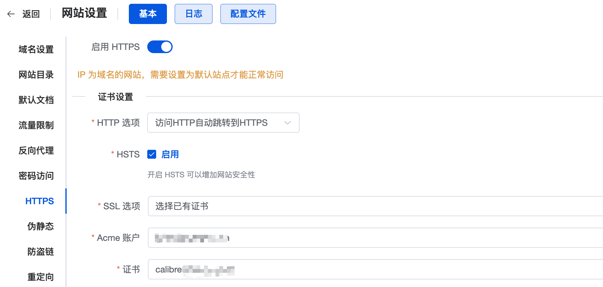

本文介绍通过 1Panel，部署 Calibre-Web 并将其集成到个人域名中，并且设置Gmail SMTP服务，通过 Calibre-Web 向 Kindle 发送图书。完成本文操作需要有一台 VPS，并且有一个域名并使用 Cloudflare 进行 DNS 解析。

本文封面图片来自 [Calibre-Web GitHub](https://github.com/janeczku/calibre-web)。

## 1. VPS 部署 1Panel

首先，需要在 VPS 上安装 1Panel，这是一个开源的服务器管理面板，可以帮助我们快速部署和管理各种应用。具体步骤如下：

如何部署和登陆参考 1Panel 的GitHub仓库：https://github.com/1Panel-dev/1Panel

## 2. 安装 Calibre-Web 应用

1Panel 提供了一个简便的应用商店，可以直接从中安装 Calibre-Web：

1. 在 1Panel 的应用商店中，搜索并找到 **Calibre-Web** 应用。
2. 安装 Calibre-Web，并将其端口设置为 **40109**（当然你可以设置其他端口，但为了本篇示例，我们使用 40109）。
3. 安装完成后，Calibre-Web 将会运行在 `http://your_vps_ip:40109`，这时候你可以通过浏览器访问 Calibre-Web （前提是你的 VPS 防火墙开放了 40109 端口）。

从1panel的容器那一栏也可以看到 Calibre-Web 的容器已经运行，其实1panel的应用商店就是通过Docker容器的方式部署应用的。

## 3. 添加域名并反向代理

为了通过自己的域名访问 Calibre-Web，可以在 1Panel 中添加网站，并通过反向代理将其指向 Calibre-Web 的端口。

假设你的个人域名是`example.com`，在 1Panel 中进入“网站”管理，点击“创建网站”，主域名输入你想使用的域名，例如：`calibre.example.com`，类型选反向代理，代理地址填入`127.0.0.1:40109`，如下图所示：

## 4. Cloudflare DNS 设置

如果你使用的是 Cloudflare 来管理域名的 DNS，那么你需要在 Cloudflare 中为 `calibre.example.com` 配置相应的 DNS 记录。

1. 登录到 Cloudflare 控制台，选择你的域名 `example.com`。
2. 添加一条 `A` 记录，名称为 `calibre`，并将 IP 地址指向你的 VPS。
3. 确保开启 **代理模式**（橙色云图标），这样 Cloudflare 会代理流量并提供额外的安全性和性能提升。

## 5. 添加域名证书

为了让网站支持 HTTPS，我们需要为 `calibre.example.com` 添加 SSL 证书。1Panel 提供了简单的证书管理功能，可以自动为你申请 Let's Encrypt 证书。

1. 在 1Panel 网站一栏中，进入证书设置。
2. 点击“申请证书”，选择你的域名 `calibre.example.com`，acme账号（如果没有，可以先创建），验证方式我选`http`，勾选`自动续签`，点击“确认”。

完成后，网站将支持 HTTPS 访问。

## 6. 启用 HTTPS

在网站`calibre.example.com`的设置中，将 **HTTPS** 那一栏开启 **启用HTTPS**，并选择你刚刚申请的证书。这样，我们就可以通过 HTTPS 访问 Calibre-Web 了。打开浏览器，输入`calibre.example.com`，能看到已经启用了 HTTPS 的 Calibre-Web 页面。

## 7. 修改管理员密码和开启上传功能

初次登录 Calibre-Web 后，强烈建议**立即修改管理员账号密码**，并启用上传功能。

1. 默认管理员账号是 `admin`，密码是 `admin123`。
2. 登录后，进入设置页面，修改管理员用户名和密码。
3. 在设置中，还可以启用电子书上传功能，允许你直接在网页上上传新的电子书到你的个人书库中。

如果你不想别人注册使用你的 Calibre-Web，可以在设置中关闭注册功能。

## 8. 开启 Gmail SMTP

Calibre-Web 允许你直接通过邮件将电子书发送到 Kindle 设备。为了实现这个功能，我们需要配置 Gmail 的 SMTP 服务。

1. 登陆Gmail，进入设置，找到 **转发和 POP/IMAP** 选项卡，开启 **IMAP** 服务。
2. 登录到你的 Google 账号，前往 [Google App 密码](https://myaccount.google.com/apppasswords) 页面，生成一个新的 App 密码（用于外部应用访问你的 Gmail）。
3. 记下生成的密码，它将用于配置 Calibre-Web 的 SMTP 设置。

## 9. 配置 Calibre-Web 的 SMTP 设置

在 Calibre-Web 中，填写刚才生成的 Gmail SMTP 信息：

1. 打开 Calibre-Web 的管理设置页面，找到 **SMTP 邮件服务器设置** 设置。
2. 输入以下信息：
   - SMTP 服务器：`smtp.gmail.com`
   - SMTP 端口：`587`
   - SMTP 用户名：你的 Gmail 地址
   - SMTP 密码：使用 Google App 密码
   - 加密方式：`STARTTLS`

保存设置后，Calibre-Web 就可以通过你的 Gmail 地址发送邮件了。

## 10. 测试向 Kindle 发送图书

最后一步，测试一下向 Kindle 发送电子书的功能：

1. 在`用户设置`的**接收书籍的电子阅读器邮箱地址**中填入你的 Kindle 电子邮箱地址。
2. 确保在 Kindle 设置中，已经允许接收来自你这个Gmail地址的邮件发送文档。
3. 在 Calibre-Web 中选择一本书，点击 **发送EPUB到电子阅读器**。
4. 如果 SMTP 配置正确，你应该能够收到来自Amazon的邮件，提示你有新的文档到达，需要`Verify Request`。

## 总结

通过以上步骤，在 VPS 上通过 1Panel 部署了 Calibre-Web，并且配置了域名和 HTTPS 访问。现在，你可以通过 Calibre-Web 管理和分享你的电子书库，甚至直接将书籍发送到 Kindle。

## 参考资料

- [1Panel GitHub](https://github.com/1Panel-dev/1Panel)
- [Calibre-Web GitHub](https://github.com/janeczku/calibre-web)
- https://www.cnblogs.com/jiyuwu/p/16313476.html
